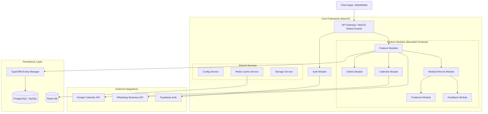
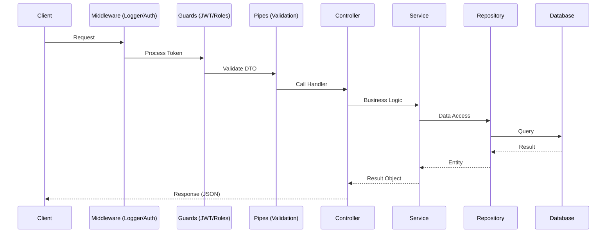

# 🏛️ Visão Geral da Arquitetura — Clinic Backend

O **Clinic Backend** é construído sobre uma arquitetura de **Monólito Modular**, utilizando o ecossistema NestJS para garantir escalabilidade e manutenibilidade.

## 📊 Diagrama de Arquitetura de Alto Nível



## 🏗️ Design Principles

1.  **Modularidade Extrema**: Cada diretório em `src/modules` representa um subdomínio de negócio isolado. A comunicação entre módulos deve ser feita preferencialmente via injeção de serviços, evitando dependências circulares.
2.  **Type Safety**: Utilização rigorosa de TypeScript, incluindo DTOs tipados e interfaces para todas as integrações externas.
3.  **Centralized Configuration**: Nenhuma variável de ambiente é acessada via `process.env` fora do `app.config.ts`. Todos os componentes devem injetar o `ConfigService`.
4.  **Graceful Degradation**: Integrações externas (WhatsApp, Google) possuem tratamento de erro isolado para não impactar o fluxo principal da aplicação.

## 🛠️ Stack Tecnológica Detalhada

| Camada | Tecnologia | Justificativa Sênior |
| :--- | :--- | :--- |
| **Framework** | NestJS v10 | Padronização, suporte a DI e ecossistema robusto para Node.js. |
| **ORM** | TypeORM v0.3 | Flexibilidade para Data Mapper pattern e suporte excelente a migrations. |
| **Cache** | Redis (ioredis) | Redução de latência em operações repetitivas e controle de rate limiting. |
| **Auth** | Supabase/JWT | Offloading de segurança e gerenciamento de identidade para um provedor especializado. |
| **Validation** | Class Validator | Validação declarativa em tempo de execução via decorators nos DTOs. |

## 🔄 Fluxo de Processamento de Requisição (Request Lifecycle)



## 📂 Padrão de Pasta por Módulo

Seguimos a convenção NestJS para organização interna de cada módulo:
```
modules/my-module/
├── my-module.module.ts      # Definição do módulo e injeções
├── my-module.controller.ts  # Endpoints e roteamento
├── my-module.service.ts     # Lógica de negócio (Domain logic)
├── dto/                     # Schemas de validação (In/Out)
│   ├── create-my-module.dto.ts
│   └── response-my-module.dto.ts
└── entities/                # Definição de tabelas (ORM)
    └── my-module.entity.ts
```

---
> [!NOTE]
> Esta arquitetura foi desenhada para suportar uma migração futura para Microserviços, caso o volume de dados ou carga de usuários exija escalabilidade horizontal independente por módulo.
